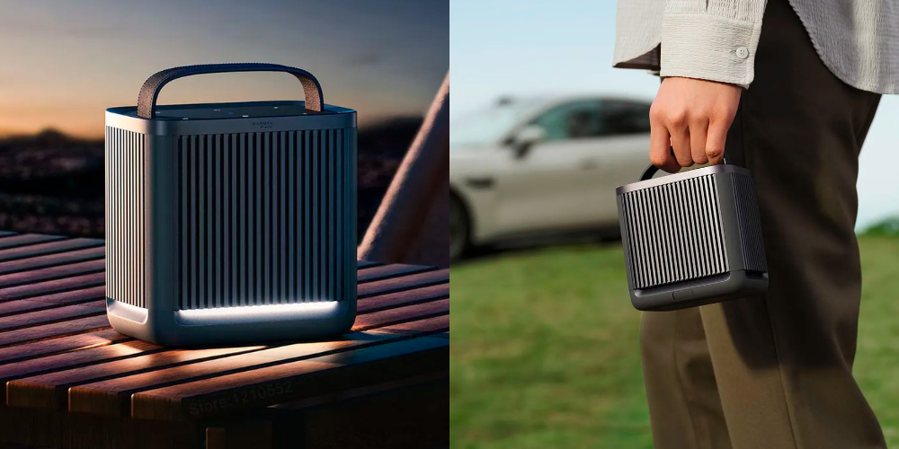

`4,490 грн`
`14 годин` працює від аккума
Плюси: класна якість звуку; usb-c розʼєм; лампа-нічник; доволі портативна
Мінуси: сенсорні кнопки
***
undefined
`6,575 грн`
`11 годин` працює від аккума
Плюси: єбєйший звук, дизайн
Мінуси: велика, через шо не дуже портативка, хоча і має аккум; dc-розʼєм
***
undefined
`3253 грн`
`10 годин` працює від аккума
Плюси: дизайн, компактність, usb-c; можна ще взяти непоганий годинник
Мінуси: гірший звук за попередні, але він теж якісний 