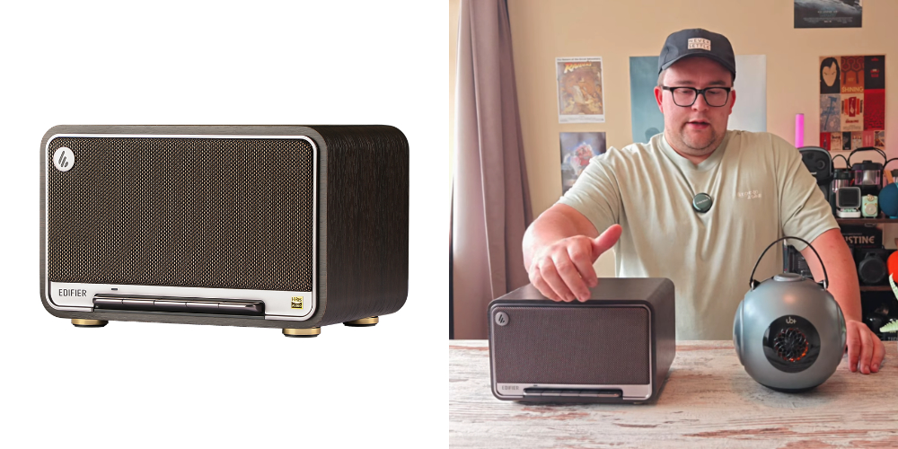
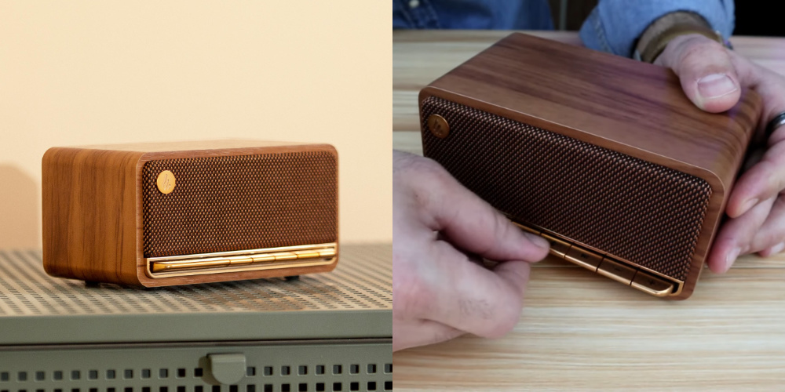

`4,490 грн` Xiaomi Camp HARMAN AudioEFX
`14 годин` працює від аккума
Плюси: класна якість звуку; usb-c розʼєм; лампа-нічник; доволі портативна
Мінуси: сенсорні кнопки
***

`6,575 грн` Edifier D32
`11 годин` працює від аккума
Плюси: єбєйший звук, дизайн
Мінуси: велика, через шо не дуже портативка, хоча і має аккум; dc-розʼєм
***

`3253 грн` Edifier MP230
`10 годин` працює від аккума
Плюси: дизайн, компактність, usb-c; можна ще взяти непоганий годинник
Мінуси: гірший звук за попередні, але він теж якісний 
